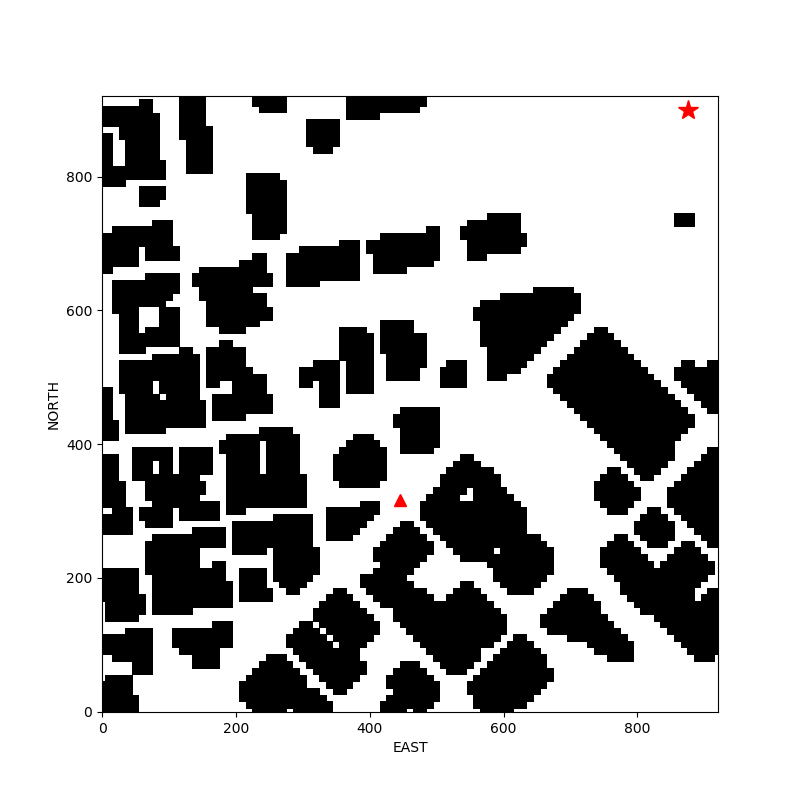

## Project: 3D Motion Planning

### Required Steps for a Passing Submission ([Rubric](https://review.udacity.com/#!/rubrics/1534/view) Points):
- [x] Load the 2.5D map in the colliders.csv file describing the environment.
- [x] Discretize the environment into a grid or graph representation.
- [x] Define the start and goal locations.
- [x] Perform a search using A* or other search algorithm.
- [x] Use a collinearity test or ray tracing method (like Bresenham) to remove unnecessary waypoints.
- [x] Return waypoints in local ECEF coordinates (format for `self.all_waypoints` is [N, E, altitude, heading], where the drone’s start location corresponds to [0, 0, 0, 0].
- [ ] Write it up.


---
### Writeup / README

#### 1. Provide a Writeup / README that includes all the rubric points and how you addressed each one.  You can submit your writeup as markdown or pdf.
You're reading it! Below I describe how I addressed each rubric point and where in my code each point is handled.


### Explain the Starter Code

#### 1. Explain the functionality of what's provided in `motion_planning.py` and `planning_utils.py`

[`motion_planning.py`](https://github.com/thhuang/Motion-Planning-Project/blob/master/motion_planning.py) is implemented with a event-driven code similar to [`backyard_flyer.py`](https://github.com/thhuang/Backyard-Flyer-Project/blob/master/backyard_flyer.py).
Moreover, a planning state is added to automatically generate waypoints.


Functions and classes for path planning is written in [`planning_utils.py`](https://github.com/thhuang/Motion-Planning-Project/blob/master/planning_utils.py).
Since the planning algorithm is based on the graph search, nodes should be sampled before constructing the graph.
In order to speed up the process, the graph (Fig 1) will be generated only once from the 2.5D map and be reused every inference.

<div align = 'center'>
    
    
</div>
<p align = 'center'>
    Fig 1: A graphs with 2000 nodes (left) and a graph with 6000 nodes (right).
</p>


In the planning state, current local position of the drone is determined as the starting position; the goal position is randomly sampled from the free space in the 2.5D map (Fig 2).
A*, a search algorithm, is used for searching path through nodes in the graph (Fig 3).
Finally, the path is pruned to get final waypoints (Fig 3).
After planning, the drone will take off, go through waypoints, and fly to the goal.

<div align='center'>
    
</div>
<p align = 'center'>
    Fig 2: An example of the start position (triangle) and the goal position (star).
</p>


<div align='center'>
    
    
</div>
<p align = 'center'>
    Fig 3: Path waypoints before (left) and after (right) pruned.
</p>


#### 1. Set your global home position

Since the pre-determined global home position is written in the first line of [`colliders.csv`](https://github.com/thhuang/Motion-Planning-Project/blob/master/colliders.csv#L1), 
[`planning_utils.get_global_home`](https://github.com/thhuang/Motion-Planning-Project/blob/master/planning_utils.py#L195-L200) can extracts the coordinate from it and returns with an altitude (default is 0.0).

```python
def get_global_home(map_name, alt0=0.0):
    with open(map_name, 'r') as file:
        lat0, lon0 = re.findall(r'-?[1-9]\d*\.?\d*', file.readline())

    global_home = [float(lon0), float(lat0), alt0]  # alt0 is set to 0
    return global_home
```


#### 2. Set your current local position

Here as long as you successfully determine your local position relative to global home you'll be all set. Explain briefly how you accomplished this in your code.


#### 3. Set grid start position from local position

This is another step in adding flexibility to the start location. As long as it works you're good to go!


#### 4. Set grid goal position from geodetic coords

This step is to add flexibility to the desired goal location. Should be able to choose any (lat, lon) within the map and have it rendered to a goal location on the grid.


#### 5. Modify A* to include diagonal motion (or replace A* altogether)

Minimal requirement here is to modify the code in planning_utils() to update the A* implementation to include diagonal motions on the grid that have a cost of sqrt(2), but more creative solutions are welcome. Explain the code you used to accomplish this step.


#### 6. Cull waypoints 

For this step you can use a collinearity test or ray tracing method like Bresenham. The idea is simply to prune your path of unnecessary waypoints. Explain the code you used to accomplish this step.


### Execute the flight
#### 1. Does it work?
It works!
<div align='center'>
    
</div>
